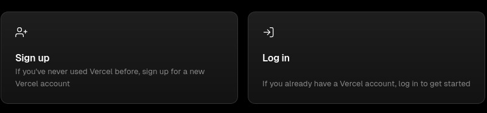
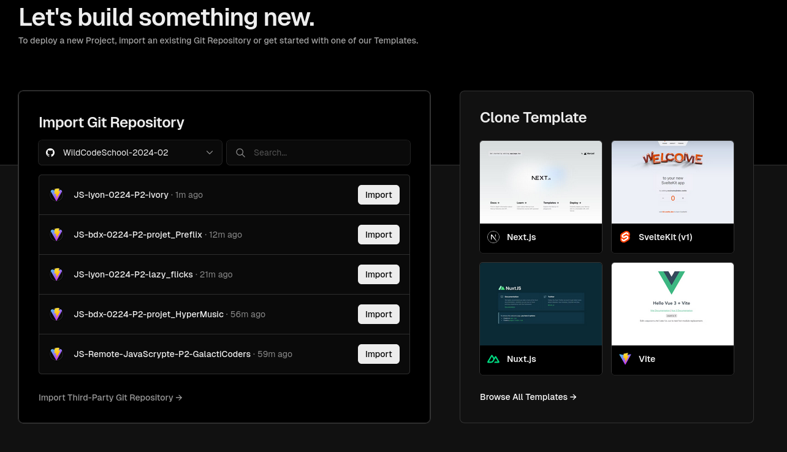
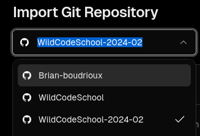
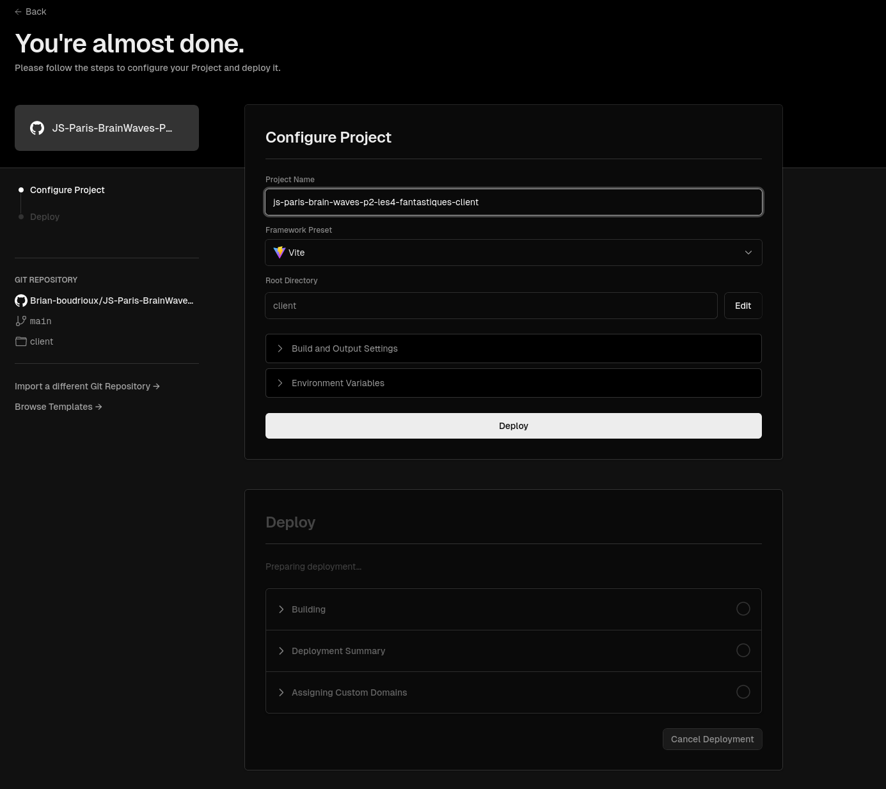
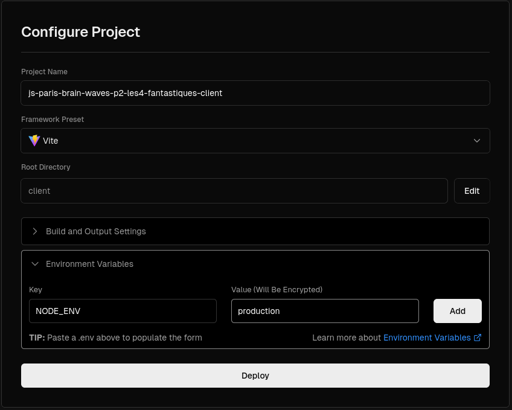
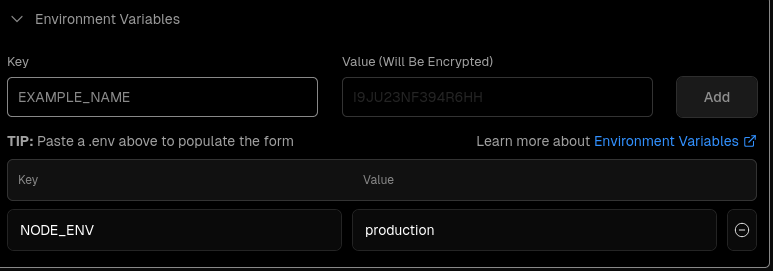
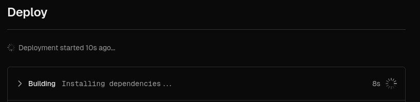
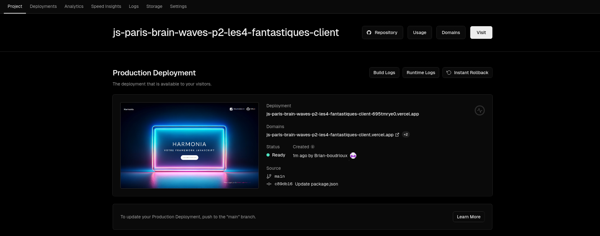

# Déploiement de l'application React sur Vercel

[⬅ English Version](./)

Le Frontend Cloud de Vercel fournit l'expérience et l'infrastructure aux développeurs pour créer, faire évoluer et sécuriser un Web plus rapide et plus personnalisé. Vercel est la plateforme la plus simple pour déployer le site Web. En connectant le référentiel GitHub dans le vercel, vous pouvez simplement déployer la branche principale ou principale sur les domaines vercel.
{:.alert-info}

## Que signifie « déployer » dans un monde réactif ?

React est une superposition pour JS natif. Concrètement, c'est une bibliothèque JS, un ensemble de fonctions qui vont nous simplifier la vie. Ce faisant, les développeurs travailleront avec une multitude de fichiers pendant la phase de développement.

A chaque fois que cette phase est réalisée, le code entre en phase de production, c'est à dire prêt à être mis en ligne. React construira ensuite notre site. Cela réduira tous nos fichiers en HTML, CSS et JS optimisés.

Il ne vous reste plus qu'à récupérer ces fichiers et à les mettre en ligne, comme dans l'atelier précédent : [Deploy 01 - Vanilla](https://wildcodeschool.github.io/workshop-deploy-vanilla/README-FR).

Bien sûr, ce serait trop facile. Il y a forcément quelques bugs lorsqu'il s'agit d'importer des images ou des liens par exemple. Oui, DevOps est un travail difficile.

## Préparation

Créez un dépôt sur GitHub pour votre projet ou forkez le dépôt sur votre propre compte : le dépôt d'équipe nécessite un compte pro pour être déployé sur Vercel.

### Avec Vite, pas de temps à perdre...

Les déploiements commencent par du code écrit dans l'un des plus de 35 frameworks pris en charge par Vercel, dont Vite ! Les déploiements peuvent être créés via la CLI Vercel ou en envoyant du code vers votre référentiel git. L'intégration Vercel Git écoute automatiquement votre commit et déclenche un nouveau déploiement.

### Configuration Harmonie

Si vous avez utilisé Vite pour générer votre projet vous pouvez directement passer à l'étape de déploiement avec Vercel, en revanche si vous avez généré votre projet via le framework Harmonia comme c'est le cas pour les projets réalisés au sein de la wildcodeschool, une petite mise à jour de votre package.json est nécessaire.

#### package.json

Modifiez le script `postinstall` de votre package.json se trouvant à la racine de votre projet comme suit :

```diff
{
- "name" : "{nom_de_votre_projet}",
- "private" : true,
-...
   "scripts": {
   "postinstall": "node -e \"if (process.env.NODE_ENV === 'production'){process.exit(1)} \" || husky install",
-...
   },
-...
}
```

## Configuration de déploiement de Vercel

Vercel est une plate-forme destinée aux développeurs qui fournit les outils, les flux de travail et l'infrastructure dont vous avez besoin pour créer et déployer vos applications Web plus rapidement, sans avoir besoin de configuration supplémentaire.

### Avant que tu commences

Pour commencer, créez un compte chez Vercel.


Une fois que vous avez créé un compte, vous pouvez choisir de vous authentifier soit auprès d'un fournisseur Git, soit en utilisant un e-mail.

### Importer un projet existant

Votre projet existant peut être n'importe quel projet Web qui génère du contenu HTML statique (comme un site Web contenant du HTML, CSS et JavaScript). Lorsque vous utilisez l'un des frameworks pris en charge par Vercel, nous détecterons et définirons automatiquement les configurations de construction et de déploiement optimales pour votre framework.

### Connectez-vous à votre fournisseur git

Sur la page Nouveau projet, sous la section Importer le référentiel Git, sélectionnez le fournisseur Git à partir duquel vous souhaitez importer votre projet.

 

N'oubliez pas de créer le référentiel de votre organisation, le référentiel d'équipe nécessite un compte pro sur Vercel.
{:.alert-warning}

### Importez votre repository

Recherchez le repository dans la liste que vous souhaitez importer et sélectionnez Importer.


### Configurer le projet

Vercel détectera automatiquement le framework et tous les paramètres de construction nécessaires. Cependant, vous pouvez également configurer les paramètres du projet à ce stade, y compris les paramètres de construction et de sortie et les variables d'environnement.



Pour définir les variables d'environnement, développez la section Variables d'environnement et collez-les ou copiez-les. Définissez la variable `NODE_ENV` sur la valeur `production` et cliquez sur Ajouter pour voir la nouvelle variable d'environnement ajoutée ci-dessous.




### Déployez votre projet

Appuyez sur le bouton Déployer. Vercel créera le Projet et le déploiera en fonction des configurations choisies.



### Profitez des confettis !

Pour afficher votre déploiement, sélectionnez le projet dans le tableau de bord, puis sélectionnez le domaine. Cette page est désormais visible par toute personne disposant de l'URL.





## Conclusion

L'installation et la maintenance de votre propre infrastructure peuvent être fastidieuses et nécessitent la sélection et la configuration du matériel serveur et du système d'exploitation appropriés, l'installation et la configuration de l'infrastructure réseau, la configuration et la maintenance de la pile logicielle nécessaire, et bien plus encore.