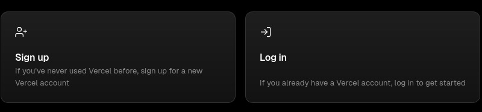
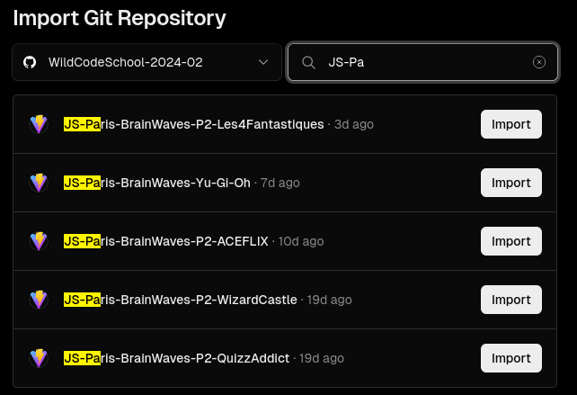
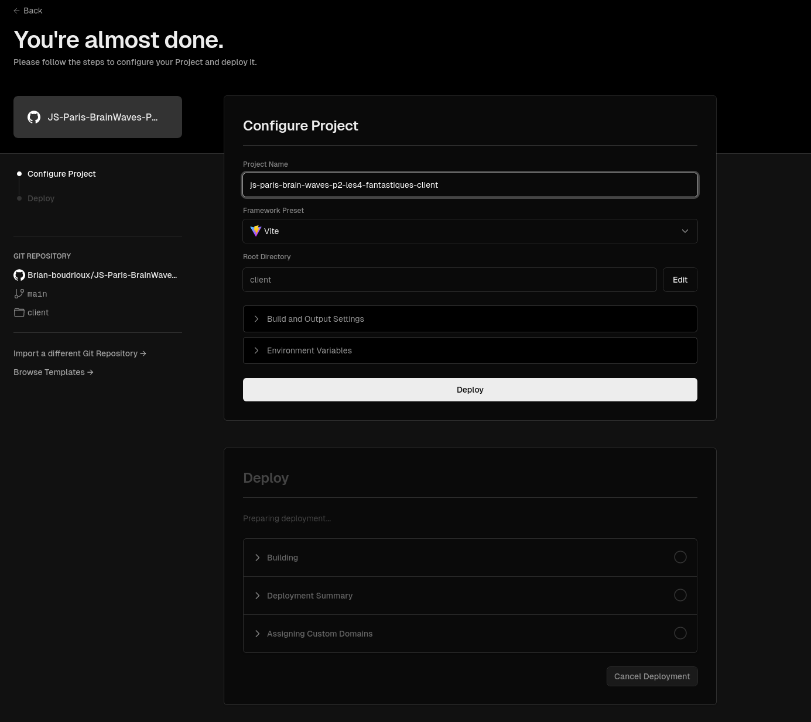
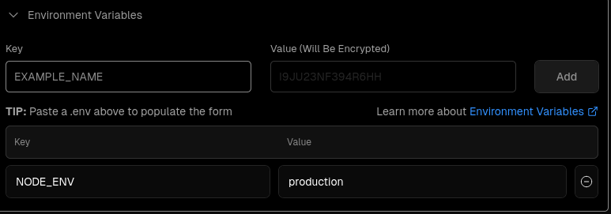
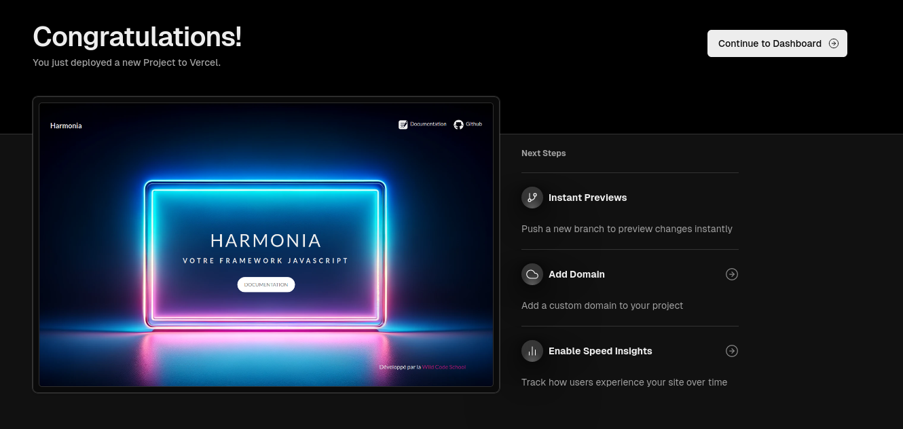
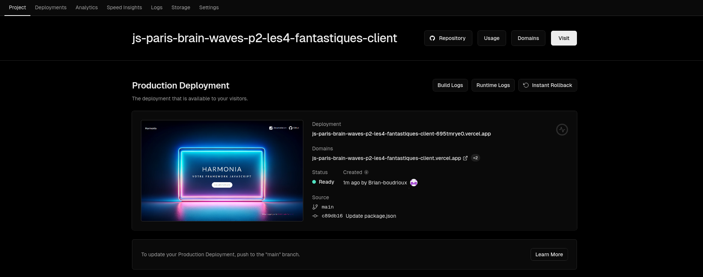

# Deploying react app on Vercel

[⬅ Version Française](./README-FR)

Vercel's Frontend Cloud provides the developer experience and infrastructure to build, scale, and secure a faster, more personalized web. Vercel is the easiest platform to deploy the website. By connecting the GitHub repository in the vercel you can simply deploy the master or main branch to the vercel domains.
{:.alert-info}

## What does "deploy" mean in a react world?

React is an overlay for native JS. In concrete terms, it's a JS library, a set of functions that will simplify our lives. In doing so, developers will be working with a multitude of files during the development phase.

Each time this phase is completed, the code enters the production phase, i.e. ready to be put online. React will then build our site. It will reduce all our files to optimized HTML, CSS and JS.

All you have to do is retrieve these files and put them online, as in the previous workshop: [Deploy 01 - Vanilla](https://wildcodeschool.github.io/workshop-deploy-vanilla/README-FR). Right?

Of course, that would be too easy. There are bound to be a few bugs when it comes to importing images or links, for example. Yes, DevOps is a hard work.

## Preparation

Create a repository on GitHub for your project or fork the repository on your own account : team repository require pro account to be deployed on Vercel.

### With Vite, no time to waste...

Deployments start with code written in one of the over 35 frameworks supported by Vercel including Vite ! Deployments can be created through the Vercel CLI or by pushing code to your git repository. The Vercel Git integration automatically listens for your commit and triggers a new deployment.

### Harmonia configuration

If you used Vite to generate your project you can directly move on to the deployment stage with Vercel, on the other hand if you generated your project via the Harmonia framework as is the case for projects carried out within the wildcodeschool, a small update of your package.json is necessary.

#### package.json

Modify the `postinstall` script of your package.json located at the root of your project as follows :

```diff
{
-  ...
-  "scripts": {
    "postinstall": "node -e \"if (process.env.NODE_ENV === 'production'){process.exit(1)} \" || husky install",
-    ...
  },
-  ...
}
```

## Vercel deploy config

Vercel is a platform for developers that provides the tools, workflows, and infrastructure you need to build and deploy your web apps faster, without the need for additional configuration.

### Before you begin

To get started, create an account with Vercel. 


Once you create an account, you can choose to authenticate either with a Git provider or by using an email.

### Import a existing project

Your existing project can be any web project that outputs static HTML content (such as a website that contains HTML, CSS, and JavaScript). When you use any of Vercel's supported frameworks, we'll automatically detect and set the optimal build and deployment configurations for your framework.

### Connect to your git provider

On the New Project page, under the Import Git Repository section, select the Git provider that you would like to import your project from.

 

Don't forget to fork the repository from your organisation, team repository require pro account on Vercel.
{:.alert-warning}

### Import your repository

Find the repository in the list that you would like to import and select Import.



### Configure project

Vercel will automatically detect the framework and any necessary build settings. However, you can also configure the Project settings at this point including the build and output settings and Environment Variables.



To set environment variables, expand the Environment Variables section and either paste or copy them in. Set the `NODE_ENV` variable to the value `production` and click to Add to see the new env variable added below




### Deploy your project

Press the Deploy button. Vercel will create the Project and deploy it based on the chosen configurations.


### Enjoy the confetti!

To view your deployment, select the Project in the dashboard and then select the Domain. This page is now visible to anyone who has the URL.





## Conclusion

Setting up and maintaining your own infrastructure can be tedious, and requires selecting and configuring the appropriate server hardware and operating system, setting up and configuring network infrastructure, configuring and maintaining the necessary software stack, and more.

Ensuring that your infrastructure is secure and scalable requires continuous monitoring, maintenance, and updating. This includes implementing security protocols and solutions to protect against threats and vulnerabilities, as well as ensuring that your infrastructure can handle a spike in traffic efficiently. All these tasks are time-consuming, complex, and require a dedicated team of experienced engineers to handle at scale.


